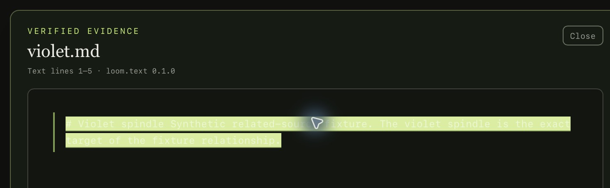
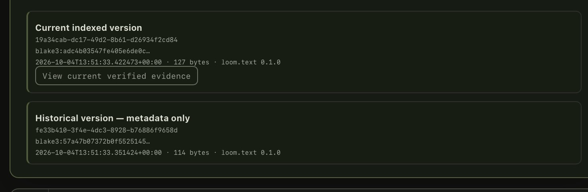

# Issue 0302 — provenance relationship evidence

- Issue: [#31](https://github.com/AlisinaDevelo/LOOM/issues/31)
- Implementation PRs: [#223](https://github.com/AlisinaDevelo/LOOM/pull/223),
  [#310](https://github.com/AlisinaDevelo/LOOM/pull/310),
  [#311](https://github.com/AlisinaDevelo/LOOM/pull/311)
- Latest runtime verification: merged main `0a533a6f142fb7713eeb81cb8abbf8dd16ac5ca6`
- Roadmap status: `done`
- Verification status: core, CLI, frontend, extension, migration and packaged native navigation
  checks pass on the target device. The dependent browser-capture permission/release gates
  remain separate open gates; no consented human workflow study is claimed. Earlier resource-limited
  attempts below are historical, not the current desktop build result.

## Agent-driven interactive session (2026-10-04 UTC)

The packaged debug app was rebuilt and operated at merged main
`0a533a6f142fb7713eeb81cb8abbf8dd16ac5ca6` on Apple M1/macOS 26.6.2 (25G83), arm64,
with Rust 1.96.0, Node 26.7.0 and npm 11.19.0. Only the test app identifier, title and
window configuration differed from the ordinary build. This was an **agent-driven desktop
session**, not a person-run session or participant usability study.

The isolated library contained five synthetic/CC0 files, six versions and one `observed`
relationship seeded through the public core API. No private files or normal LOOM library
were opened. The native UI verified:

- `Cmd+K` and Enter searched `amber spindle` and returned the revised `amber.md` source.
- `View evidence` resolved its exact passage, hash and text-line anchor.
- `Source versions` showed the current version plus a metadata-only historical version;
  only the current version offered verified evidence.
- `Show relationships` → the related `violet.md` source → its current-version action
  displayed the target's verified passage without a graph database.
- Changing the target's fixture bytes without reindexing produced `Source needs attention`;
  no old passage remained represented as verified. Restoring the bytes and reindexing recovered it.
- Escape and Close returned keyboard focus to the original result's `View evidence` button;
  Return reopened it, including after relationship navigation and a stale-error viewer.

This run found a macOS WebKit pointer-focus defect. [PR #335](https://github.com/AlisinaDevelo/LOOM/pull/335)
fixed it by remembering the clicked result action explicitly. Four new/strengthened focus
assertions failed on the previous code. At the merged SHA, `npm run check` passed 43 UI,
12 extension and six tooling tests, typecheck, lint and build; the nine accessibility-contract
tests and `make roadmap-check` passed. The isolated packaged build and native interactions
above were repeated after merge. Strict Cargo audit still reports the separately tracked
advisories; no security-audit, signed-release, browser-gesture or human-study pass is implied.

After quitting the app, fixture purge removed five artifacts, six versions, six passages
and the relationship. Root/artifact/version/passage counts and indexed bytes were zero;
the isolated test app-data directory was removed from Application Support. This is
application-level cleanup, not a secure-erasure claim.

Only the cropped LOOM panels below were retained; desktop, sidebar and source-path lines
are excluded. Uncropped temporary captures were deleted after crop inspection.





| Artifact | SHA-256 |
| --- | --- |
| Packaged executable | `450c8a8417ba1cb11b776d8b997b220b863a545e6d99181a2a928a8913bd40a1` |
| Merged native build log | `48cfe464fdd858935317512e96b958f490a01298ad45ca5d860a1be0d9c79b6d` |
| Merged frontend check log | `0f3a55d4d1bb5d38fcd4fb3e037ab8726ebe61a1f0289c23a47044d0b31b9ab3` |
| Related-source crop | `e80d50e59eecfeeee623630985300d5b85143ce2ae1557728f6ee34b08063ba1` |
| Version-history crop | `801c1edec755d194724867e14b6b075da89ac75e36e4e9fd09a1e2d26f496af3` |
| Fixture purge report | `61f60c604bef987d227762d052d6f775df443d22f820ccf137a0b937aee3bae4` |
| Post-purge counts | `fa53fd3f5c4206765bddc6077fed4532e7464679b11d06f6d3ed0799c76f1e51` |

## Current source/version navigation (2026-10-02 UTC)

The Rust history API returns bounded current-first version metadata (20 records in the UI,
clamped to 1–100 in the core), with a visible truncation indicator. Only the currently eligible
file version with a passage receives a resolvable evidence tuple. Historical bytes are not
retained; bookmark, empty-file and revoked-source histories remain metadata-only.

Eight provenance integration tests verify stable identity, bounded ordering/truncation,
current-version resolution, old/forged/revoked tuple refusal, changed-byte refusal,
unknown IDs and metadata-only records. The Tauri command registration and tracked allow/deny
permissions are checked. UI tests cover current related-source navigation, stale refusal,
non-file records, out-of-order history/relationship responses and closing a pending viewer.

The packaged debug app was built and operated at merged-main
`48d8c62a66957c64e16dd44de11a0b60692d3c26`, whose tree is identical to its tested PR #311
candidate. Later gate/CLI edits through `6cf1604` did not change desktop/core navigation code.
The isolated app identifier `dev.loom.source-validation` used a fresh synthetic-only library;
the normal LOOM application data was not touched. Two local Markdown files, three versions and
one explicitly seeded `synthetic-fixture` relationship supplied the test corpus.

Through the packaged UI and native IPC, searching `amber spindle` opened the source and its
two version records. Selecting the related source and its current-version action displayed
the verified `Violet spindle` passage with artifact/version/hash and line range 1–4. The old
version was metadata only, not represented as an immutable byte snapshot.

After the related file's bytes changed without reindexing, the current-version action displayed
`Source needs attention` and stale-or-unavailable, without retaining the old passage as verified
evidence. The fixture bytes were restored and indexed again afterward. A screenshot of the
positive result was captured inline, cropped to the application window with synthetic content
only; no full-desktop/private-document image or local PNG artifact was created.

The build log is `/tmp/loom-source-version-evidence.1ghGPQ/native-app-build.log`, SHA-256
`13b4cdbb99b25640b70a248a18d8c778a195b6c66c84bbabddcd61e148500965`.
The command/source and interactive-session record is `merged-main-regression.md` in the same
retained directory. The subsequent actual merged-main regression ran 182 Rust workspace tests,
139 core/CLI tests on Rust 1.88, 35 UI and 12 extension tests, warnings-denied Clippy, typecheck,
lint/build, 24 Python/8 CI/10 protocol tests and both benchmark commands; digests are recorded in
[0110-device.md](0110-device.md). This historical automated native session was not a participant
usability, browser toolbar/permission or signed-release test. Issue #31 remained in review at
that point; the 2026-10-04 session above completes its explicit interactive-viewer criterion.
Browser release and participant studies remain tracked separately.

## Target and retained evidence

| Field | Recorded value |
| --- | --- |
| Hardware | MacBook Pro 17,1; Apple M1; 8 GB |
| Operating system | macOS 26.6.2 (25G83), arm64 |
| Rust | rustc 1.96.0 / cargo 1.96.0 |
| JavaScript | Node v26.7.0 / npm 11.19.0 |
| Python | 3.9.6 |
| Merged-main run | `/tmp/loom-0302-merged-final.44MdBn` |
| Evidence manifest | `log-sha256.txt`, SHA-256 `3c33fdb06df48b0cf924b7f6f6bf3b20f7355ad4353bdea234b06ac23969f957` |
| Main protection | Ruleset `main-protection` (`21332347`), active on `refs/heads/main` |

The run directory retains merged-main core, CLI, frontend, extension, roadmap, Tauri
attempts, device disk, and toolchain logs. Its manifest is:

```text
4729924aefa8540b81df5b5ccafd11d6cf06333ec6629e39193d0995b0ba8ac0  loom-0302-merged-core-tests.log
901bb25afb64f7541928d748cac65991ecd91ff317615d006288cdb152a4c1e5  loom-0302-merged-cli-tests.log
9ee838a239a0ddb98bf46a495a27c11b75b18602456e255a15554fb0b6717a63  loom-0302-merged-frontend-check.log
b9a7949d0739b598583c8349deb0e4831999323f07024de621a270a3fe0ba244  loom-0302-merged-browser-tests.log
df36f3da734b1902d0f0e6711aeb03645bc9f04afad31993b9275c55f1a82c96  loom-0302-merged-roadmap.log
e9dca69c19b5746097fdfa0fe9c065c0408b567380d15322b5b8fd489f137e65  loom-0302-merged-tauri-check.log
037a75845b50ab29f4f4872508aaee55175e1e524a8763a7da46c8d968966bcc  loom-0302-merged-tauri-lib-check.log
1c75a57caf8bf81a23e3de99ac83be34da2305755f7073bb744e1b7886d00075  device-disk.txt
16e5956000df2cea068d6bba8a3805974eb81310297205c42e45d3d96bbf5a89  device-toolchain.txt
```

## Acceptance mapping

| Artifact ID | Acceptance criterion | Retained evidence |
| --- | --- | --- |
| `LOOM-0302-SCHEMA` | Versioned typed relationships preserve future kinds | `RelationshipKind` serializes known values and preserves `Unknown(String)`. The v6 table adds an independent relationship schema version, origin, metadata envelope, endpoint and confidence checks. `schema_compatibility` passes six tests, including populated v2, v3, v4, and v5 migrations without rewriting canonical rows. |
| `LOOM-0302-INFERENCE` | Inferred links record method, evidence, confidence, and time; confirmation stays distinct | `add_relationship` rejects inferred rows without both passage evidence and confidence, requires a non-empty method, records RFC3339 `created_at`, and stores `origin` separately. `provenance` covers round-trip metadata, unknown kinds, invalid evidence, NaN confidence, oversized/non-object metadata, and user-confirmed edges. |
| `LOOM-0302-TRAVERSE` | UI traverses source and versions without a graph database | `list_relationships` returns bounded endpoints; `artifact_version_history` returns current-first versions and resolvable current-file evidence only. The React test `navigates a related source through its current verified version without substituting historical bytes` verifies the exact native tuple, with stale and async-race negatives. The packaged positive/stale session and current merged-main checks are recorded above. |

## Merged-main device checks

These commands were rerun at merged SHA `217903c82e500b85519781cf2beb3da403808d5e`.
Hosted GitHub Actions were not used as evidence.

```text
cargo test --locked -p loom-core --lib --tests  81 passed; 0 failed
cargo test --locked -p loom-cli                    9 passed; 0 failed
npm run check                                      passed
npm run test:browser-extension                     10 passed; 0 failed
python3 scripts/roadmap.py --validate-only        valid
cargo fmt --all -- --check                        passed
git diff --check                                  passed
```

`npm run check` ran ESLint, Markdown lint over 71 files, Vitest (21 tests), TypeScript,
and a Vite production build. The roadmap validator reported 154 active issues, 4 retired
issues, 20 milestones, 13 phases, 141 parent edges, and 314 dependency edges.

The merged-main `cargo check --locked -p loom` attempt reached the macOS dependency graph
but failed with `ENOSPC` while writing `sha2` metadata. The narrower `cargo check --locked
-p loom --lib` attempt reached `tauri` and failed with `ENOSPC` while writing its metadata.
The same desktop check passed on the implementation commit before merge; no merged-main
desktop pass is claimed until this Mac has sufficient free space. The earlier test-profile
attempt likewise failed while compiling `objc2-app-kit` for the same device-capacity reason.

## Failure, privacy, and recovery coverage

- Self-edges, empty/unknown kinds, missing passage bindings, non-finite confidence,
  inferred-without-evidence, non-object metadata, and oversized metadata fail closed before
  a row is written.
- Repeating an identical relationship is idempotent; purging an endpoint cascades the edge.
- Endpoint reads are bounded to 100 rows, expose hashes and active locators, and return an
  unavailable source state instead of inventing a path.
- Relationship metadata is stored as a bounded JSON object and is not rendered as HTML by
  the viewer. The relationship command is read-only; no network or account is required.
- v2–v5 migration fixtures verify defaults, canonical identity preservation, and FTS recovery.

No desktop screenshot was used in that historical run. The current packaged session above used
an application-window-only capture of synthetic content, with no private source material.

## Merged-main desktop rerun (2026-09-28)

With enough free storage, `scripts/verify-device.sh` was rerun on the same Mac at merged-main
`f0352715f41985dfba4d1aa6f8c48806d4d0f16d`, which includes this relationship work. All 28 steps
passed (`summary.txt` SHA-256 `935a5c1f77e804911a5675a0eaecf1f2f8a954f51585d8920b19269da660bb31`,
`log-sha256.txt` SHA-256 `c406efb31007b6d56536ec34c4c36d87a19f34a4dea8ede1dde1b8640b32555c`),
including `cargo clippy --workspace --all-targets`, the locked workspace test profile (139
passed, 0 failed; `rust-workspace.log` SHA-256
`36ca1b4ec5c9799ba50cd8d46a759e77d135f2741ef3ef9b3a977b270359550d`), the Rust 1.88 workspace
check, and `npm run tauri build -- --debug --no-bundle` (`tauri-build.log` SHA-256
`c4b6bee208700406f70bb46424727196867ffe803d5e830ec468eac5f7b9903d`). This clears the earlier
`ENOSPC` limitation for the desktop compile/test gate.

At that historical point, no interactive session was claimed. The automated packaged session
above now covers navigation and stale refusal; the dependent browser and human study gates
remain open and no person-driven usability result is claimed.
